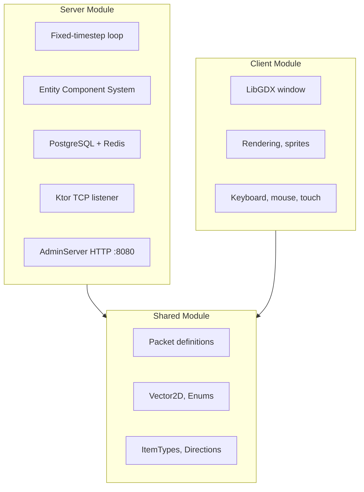
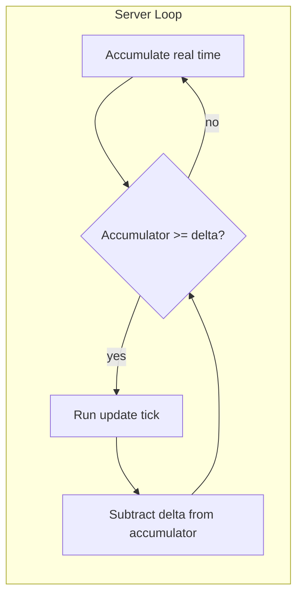

# Architecture

Single source of truth for **OtterEngine** (custom engine powering **Runes And Rocks**). Distilled from whitepaper, tech spec, and Gradle configs.

**Classification:** *Runes And Rocks* = the game. *OtterEngine* = the custom-built engine (OtterServer, OtterCore, ECS, persistence). *OtterCore* = shared module (protocol, codec). *OtterServer* = server module.

**Phase 9 (current):** Entities & Spawning. We have completed Persistence (Phase 8), World Foundation (Phase 7), Multiplayer Sync (Phase 6), Client GUI screens (MainMenu/GameScreen), and ECS Core (Phase 4). The server successfully maintains robust lifecycle coupling matching 20 TPS, backing a Dockerized PostgreSQL + Redis integration stack. Next focus is expanding ECS for custom art, NPC roaming, and deeper gameplay features.

---

## 1. Global Stack Overview

Design philosophy: **strict decoupling**. Three domains — `Client`, `Server`, `Shared` — managed via multi-module Gradle.

| Layer | Technology |
|-------|------------|
| **Languages** | Kotlin (primary), Java (legacy interop) |
| **Build** | Gradle (Kotlin DSL) |
| **Networking** | Ktor (async raw TCP via coroutines) |
| **Serialization** | Kryo (binary, high-speed) |
| **Persistence** | PostgreSQL (relational truth) + Redis (hot cache) |
| **Client** | LibGDX (cross-platform OpenGL) |

---

## 2. Module Layout



**Shared:** Math utilities, enums, network packet definitions. No rendering, no game loop.

**Server:** Authoritative game loop, DB connections, pathfinding, socket listeners. No rendering.

**Client:** Window, OpenGL rendering, asset loading, input handling.

---

## 3. Gradle Structure

Canonical multi-module setup (resolved from `gradle_build_1.md` and `note_1.md`):

```
runes-and-rocks/
├── settings.gradle.kts
├── build.gradle.kts
├── shared/
│   └── build.gradle.kts
├── server/
│   └── build.gradle.kts
└── client/
    └── build.gradle.kts
```

**Root `settings.gradle.kts`:**
```kotlin
rootProject.name = "RunesAndRocks"
include("shared")
include("server")
include("client")
```

**Root `build.gradle.kts`:**
```kotlin
plugins {
    kotlin("jvm") version "2.3.10" apply false
    kotlin("android") version "2.3.10" apply false
    id("com.android.application") version "9.0.1" apply false
}

allprojects {
    repositories { google(); mavenCentral(); ... }
    configurations.all { resolutionStrategy { force("org.apache.logging.log4j:log4j-core:2.25.3") } }
}
```

**Shared `build.gradle.kts`:** Kryo 5.6.2 (packet serialization), LibGDX 1.14.0 core (math/vectors), ktor-io. Plain library, no `application` plugin.

**Server `build.gradle.kts`:** shared, Ktor 3.4.0, Exposed 0.50.1, PostgreSQL 42.7.10, HikariCP 7.0.2, Jedis 7.3.0 (JedisPooled), SLF4J. `application` plugin, mainClass = `ServerLauncherKt`.

**Client `build.gradle.kts`:** shared, Ktor, LibGDX 1.14.0 desktop backend (gdx-backend-lwjgl3, gdx-platform). `application` plugin, mainClass = `ClientLauncherKt`.

**Android `build.gradle.kts`:** shared, client (excl. desktop deps), gdx-backend-android 1.14.0, gdx-platform natives. compileSdk 35. AGP 9.0.1.

---

## 4. Authoritative Server

The server is headless. It validates every action. Client requests (e.g. move) are checked; server computes physics, collisions, and state.

### 4.1 Fixed-Timestep Loop

Deterministic physics and fair combat require a fixed tick rate. For 2D MMO: **20–30 TPS** typical.

- **Delta (Δt):** `1 / TPS` (e.g. 0.05s for 20 TPS)
- **Accumulator:** Real elapsed time between loop cycles
- **Logic:** While accumulator ≥ Δt, run one `update()` tick and subtract Δt from accumulator

Prevents game logic from running faster on better hardware.



### 4.2 Spatial Partitioning (Grid Routing)

O(n²) distance checks do not scale. World is divided into chunks (e.g. 32×32 tiles).

- Entities register to a chunk by (x, y)
- Events (spawn, chat, etc.) are routed only to players in that chunk and adjacent chunks

### 4.3 Entity Component System (ECS)

Avoid deep inheritance. Use ECS:

- **Entities:** Integer IDs (e.g. `EntityID: 4012`)
- **Components:** Data classes (`Position`, `Health`, `Inventory`)
- **Systems:** Logic that processes entities with specific component sets (e.g. `MovementSystem` over entities with `Position` + `Velocity`)

---

## 5. Networking & Serialization

MMORPGs prioritize reliable state over twitch reflexes. **TCP** is sufficient; packet order matters for inventory and economy.

- **Packet structure:** Sealed interface in `Shared`; all packets implement it
- **Binary serialization:** Kryo registers packet classes to IDs; sends compact byte arrays instead of JSON. ~80% bandwidth reduction

---

## 6. Client-Server Sync (from tech spec)

- **Isolate network data:** Only replicate what must be synced
- **Batch decode:** Decode incoming packets into a batch first
- **Apply state:** Iterate local entities, apply batch payloads to components that need updates

---

## 7. Ktor Raw Sockets (from tech spec)

- **Server:** `SelectorManager` on `Dispatchers.IO`, bind TCP to port
- **Client:** Same `SelectorManager`, `connect()` to server IP
- **Channels:** `ByteReadChannel` / `ByteWriteChannel` for I/O
- **Flush:** `autoFlush = true` during early dev for immediate dispatch

---

## 8. Data Persistence & Economy

- **Redis (hot path):** On login, load player from PostgreSQL into Redis. All in-session updates go to Redis.
- **PostgreSQL (cold path):** Flush Redis to PostgreSQL every 5 minutes and on logout.
- **ACID:** Trades (e.g. gold transfer) must run in DB transactions; rollback on failure to prevent duplication.

---

## 9. In-House Tooling & Management

- **Admin Web Dashboard:** A pure HTML/CSS/JS frontend (`index.html`) served natively via a Ktor `EmbeddedServer` (`AdminServer.kt`) running on port `:8080`.
  - **Communication:** Establishes a WebSocket connection. The server pushes live metrics (TPS, connections, entity count) compiled from the main `GameServer`, `TickLoop`, and ECS Engine natively every second, avoiding heavy REST polling.
- **Tilemap Integrator (Future):** A Godot-style visual editor that exports raw JSON layouts (`world.json`) matching our 2D array coordinates for seamless Server/Client tile logic processing.
- **Item/loot Editor (Future):** Web dashboard for drop rates, item stats, spawn locations.
- **Asset Packer (Future):** Pack sprites into texture atlas to reduce draw calls.

---

## 10. Testing Strategy

- **Framework:** JUnit 5 (Jupiter) via the Gradle JUnit Platform.
- **Focus:** Currently prioritized heavily towards **Core Logic Unit Tests** (e.g., `EngineTest.kt`).
  - Isolated instantiation of `Engine` and `SpatialGrid` objects with mock state.
  - Assertions applied to core data (entity lifecycle, component maps, bounds detection) to guarantee < 3s rapid validation separated from heavyweight networking or database integrations during Alpha iterative development.
  - *Note:* Heavy IO integration tests or simulated load testing are deferred until structural maturity necessitates cloud deployment.
